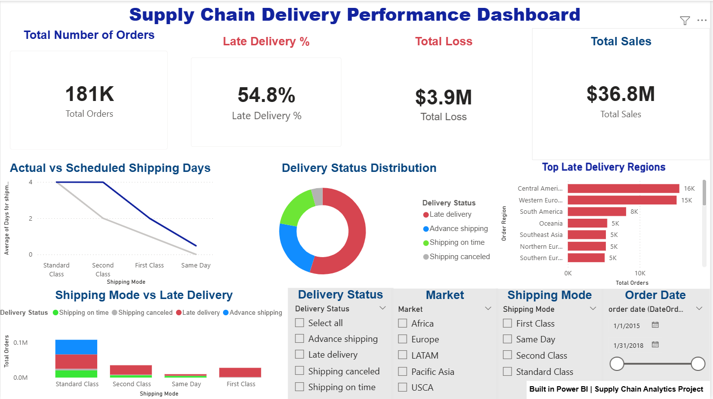
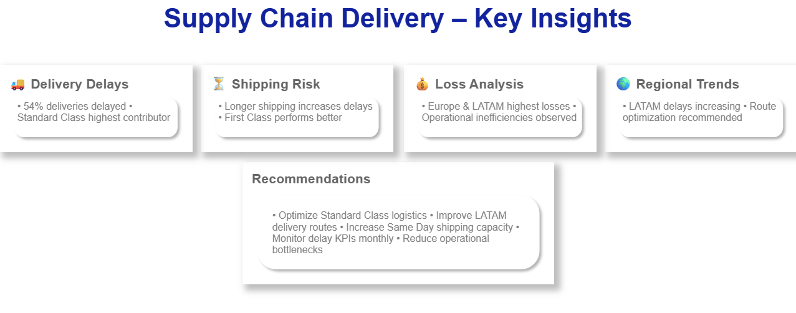

# 📦 Supply Chain Delivery Performance Dashboard

An interactive **Power BI Business Intelligence Dashboard** designed to analyze supply chain operations, delivery performance, shipping efficiency, operational losses, and regional logistics trends.

This project demonstrates real-world data analytics, KPI monitoring, and business intelligence reporting using **Power BI, Power Query, and DAX**.

---

# 🚀 Project Overview

The Supply Chain Delivery Performance Dashboard helps organizations monitor logistics operations and identify delivery inefficiencies through data-driven insights.

The dashboard provides:
- Delivery performance analysis
- Shipping efficiency monitoring
- Operational loss tracking
- Regional logistics insights
- KPI-based business reporting
- Strategic recommendations for process optimization

This project converts raw operational data into meaningful business insights that support better decision-making and operational improvements.

---

# 📷 Dashboard Preview

## Main Dashboard


## Key Insights Dashboard


---

# 🎯 Business Problem

Modern supply chain operations face several challenges including:
- High late delivery rates
- Increasing logistics costs
- Operational bottlenecks
- Shipping inefficiencies
- Limited visibility into delivery performance

Without proper analytical reporting, organizations struggle to identify delay patterns, operational risks, and performance gaps.

This dashboard was developed to provide centralized monitoring and actionable analytics for supply chain optimization.

---

# 💡 Project Objectives

The primary objectives of this project are:

- Monitor delivery performance across shipping methods
- Identify regions with high late delivery rates
- Analyze operational losses caused by delays
- Compare shipping modes based on efficiency
- Improve visibility into logistics KPIs
- Support strategic business decision-making
- Generate actionable operational recommendations

---

# 📊 Key Performance Indicators (KPIs)

| KPI | Value |
|------|------|
| Total Orders | 181K |
| Late Delivery Percentage | 54.8% |
| Total Sales | $36.8M |
| Operational Loss | $3.9M |

---

# 📈 Dashboard Features

## ✔ KPI Monitoring
Track business-critical metrics including:
- Total Orders
- Total Sales
- Late Delivery Percentage
- Operational Loss

## ✔ Delivery Performance Analysis
Analyze delivery statuses such as:
- Late Delivery
- On-Time Delivery
- Advance Shipping
- Canceled Shipments

## ✔ Shipping Mode Analysis
Compare operational performance across:
- Standard Class
- First Class
- Second Class
- Same Day Shipping

## ✔ Regional Logistics Analysis
Identify:
- High-risk delivery regions
- Delay trends across markets
- Operational inefficiencies
- Logistics bottlenecks

## ✔ Interactive Reporting
Dynamic dashboard filtering using:
- Region
- Market
- Shipping Mode
- Delivery Status
- Order Date

## ✔ Strategic Recommendations
Business-focused recommendations for:
- Route optimization
- Shipping efficiency improvement
- Delay reduction
- Operational performance enhancement

---

# 🔍 Key Business Insights

## 🚚 Shipping Insights
- Standard Class shipping contributed the highest number of delayed deliveries.
- Same Day shipping demonstrated the best delivery performance.
- Longer shipping durations increased delivery risk.
- Shipping efficiency varied significantly across delivery methods.

## 🌍 Regional Insights
- Central America and Western Europe showed the highest late delivery volumes.
- LATAM regions experienced increasing delivery delays.
- Certain regions consistently contributed to operational inefficiencies.

## 💰 Financial Insights
- Late deliveries significantly increased operational losses.
- Logistics inefficiencies negatively impacted supply chain performance.
- Operational bottlenecks increased shipping risks and costs.

---

# 📌 Business Recommendations

- Optimize Standard Class shipping operations
- Improve delivery route planning in LATAM regions
- Increase Same Day shipping capacity where feasible
- Monitor delivery KPIs regularly
- Reduce operational bottlenecks through process optimization
- Improve warehouse-to-delivery coordination

---

# ⚙️ Project Workflow

Dataset Collection → Data Cleaning → Data Transformation → Data Modeling → DAX Measures → KPI Development → Dashboard Visualization → Business Insights

---

# 🛠️ Tools & Technologies Used

| Tool / Technology | Purpose |
|------|------|
| Power BI | Dashboard Development |
| Power Query | Data Cleaning & Transformation |
| DAX | KPI Calculations & Measures |
| Data Visualization | Interactive Reporting |
| Supply Chain Analytics | Operational Analysis |

---

# 🧠 Skills Demonstrated

- Business Intelligence
- Power BI Dashboard Development
- Data Visualization
- DAX Calculations
- Power Query
- KPI Reporting
- Data Cleaning & Transformation
- Supply Chain Analytics
- Business Analytics
- Analytical Thinking

---

# 🌟 Project Impact

- Analyzed 181K+ supply chain orders
- Identified 54.8% late delivery rate across operations
- Highlighted high-risk logistics regions
- Generated actionable business recommendations
- Improved operational visibility through KPI monitoring

---

# 📁 Repository Files

| File | Description |
|------|------|
| `Supply_Chain_Delivery_Dashboard.pbix` | Power BI Dashboard File |
| `supply_chain_dataset.zip` | Dataset Used for Analysis |
| `Supply_Chain_Dashboard_Preview.png` | Main Dashboard Screenshot |
| `Supply_Chain_Dashboard_Key_Insights.png` | Key Insights Dashboard Screenshot |

---

# ▶️ How to Use

1. Download the `.pbix` file
2. Open using **Power BI Desktop**
3. Load or refresh the dataset if required
4. Explore interactive dashboard visuals and filters

---

# ⭐ Resume Project Description

Developed an interactive **Supply Chain Delivery Performance Dashboard** using Power BI to analyze logistics operations, delivery efficiency, operational losses, and regional shipping trends. Created KPI-driven visualizations using DAX and Power Query to identify operational bottlenecks, monitor shipping performance, and support data-driven business decisions.

---

# 🏆 Why This Project Stands Out

This project demonstrates:
- Real-world business problem solving
- End-to-end Business Intelligence workflow implementation
- Data storytelling and visualization
- KPI-based analytical reporting
- Strong analytical and problem-solving skills
- Business-focused insight generation

This project is highly relevant for:
- Data Analyst Roles
- Business Intelligence Analyst Roles
- Power BI Developer Roles
- Supply Chain Analyst Roles
- Operations Analyst Roles

---

# 📬 Conclusion

This project showcases the practical application of **Business Intelligence and Data Analytics** in solving real-world supply chain challenges using Power BI.

The dashboard delivers meaningful operational insights, improves visibility into logistics performance, and demonstrates strong analytical, reporting, and visualization skills valuable for modern data-driven organizations.

---
```
